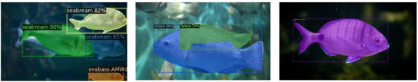
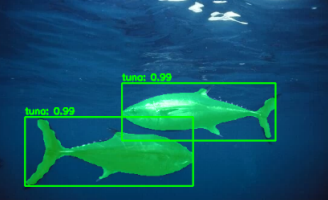

# 🐟 Fish Species Detection

## 📝 Description
**Fish Species Detection** is an artificial intelligence project focused on the automatic **detection, identification, and segmentation of fish species in aquaculture environments**.  
The system combines **YOLOv5** for fast and efficient object detection with **Mask R-CNN** for precise instance segmentation, achieving a balance between speed and accuracy.

This solution is designed to support:
- 🐠 Aquaculture management and monitoring  
- 🔬 Scientific and academic research  
- 🌊 Ecological and environmental analysis  

---

## 🎯 Objectives
- Develop an automated fish detection system using deep learning  
- Perform accurate instance segmentation of detected fish  
- Combine detection and segmentation models to improve overall performance  
- Evaluate the system using standard metrics such as accuracy and IoU  
- Enable reproducible training and inference using Google Colab  

---

## ✨ Key Features
- 🕒 Real-time fish detection in images and videos  
- 🧠 Accurate species identification using a hybrid YOLOv5 + Mask R-CNN approach  
- 🎯 Precise segmentation for morphological and statistical analysis  
- 🖼️ Image preprocessing and cleaning to enhance model performance  

---

## 📊 Dataset Description
The dataset consists of labeled images of fish species collected for aquaculture monitoring purposes.  
Each image is annotated with:
- Bounding boxes for fish detection  
- Segmentation masks for precise fish outlines  

The dataset follows a **COCO-like annotation format** and can be prepared using tools such as **Roboflow**.  
It is divided into:
- Training set  
- Validation set  
- Test set  

---

## 🧠 Methodology

### 1️⃣ YOLOv5 for Fish Detection
YOLOv5 (You Only Look Once – version 5) is used for real-time object detection.  
It processes images in a single forward pass to predict fish locations and species with high speed and good accuracy.

**Outputs:**
- Bounding boxes  
- Class labels  
- Confidence scores  

### YOLOv5 Detection

---

### 2️⃣ Mask R-CNN for Fish Segmentation
Mask R-CNN is employed to perform instance segmentation on detected fish.  
It generates pixel-level masks that accurately represent the shape of each fish.

**Outputs:**
- Segmentation masks  
- Class labels  
- Mask confidence scores  

### Mask R-CNN Segmentation

---

### 3️⃣ Hybrid Model and IoU-Based Fusion
To improve performance, the outputs of YOLOv5 and Mask R-CNN are combined using an **Intersection over Union (IoU)**–based fusion strategy:
- YOLOv5 provides fast and reliable detections  
- Mask R-CNN refines detections with accurate segmentation  
- IoU thresholds are used to merge compatible predictions  

This hybrid approach significantly improves detection accuracy and segmentation quality.

### Hybrid YOLOv5 + Mask R-CNN Result

---

## 🧩 System Architecture
The system pipeline includes:
1. Data preprocessing and annotation  
2. Fish detection using YOLOv5  
3. Fish segmentation using Mask R-CNN  
4. IoU-based fusion of detection and segmentation results  
5. Evaluation and visualization of outputs  

---

## 🛠️ Implementation Environment
- **Programming Language**: Python  
- **Deep Learning Framework**: PyTorch  
- **Detection Model**: YOLOv5  
- **Segmentation Model**: Mask R-CNN (Detectron2)  
- **Computer Vision**: OpenCV  
- **Development Platform**: Google Colab  
- **Version Control**: Git & GitHub  

---

## 🚀 Training and Model Generation 
When training is executed on **Google Colab**:
- YOLOv5 automatically generates trained models (`best.pt`, `last.pt`) and evaluation results  
- Mask R-CNN produces the final trained model (`model_final.pth`) and training metrics  
- Output directories are created automatically during execution  

To preserve models and results after the Colab session ends, **Google Drive** is mounted and used as the output directory.

---

## 📈 Evaluation Metrics
The system performance is evaluated using:
- Detection accuracy  
- Precision and recall  
- Intersection over Union (IoU) for segmentation  
- Visual analysis of detection and segmentation results  

The hybrid approach consistently outperforms single-model solutions.

---

## 🧪 Results
Experimental results show that:
- YOLOv5 provides fast and accurate fish detection  
- Mask R-CNN generates precise segmentation masks  
- The hybrid YOLOv5 + Mask R-CNN approach improves detection accuracy by approximately **12%**  
- Segmentation IoU reaches up to **78%**  

